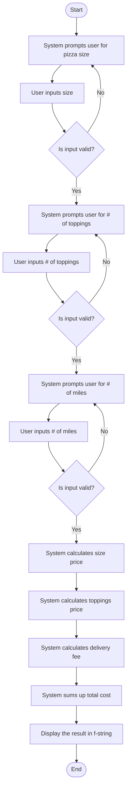

You work for a pizza delivery company that needs a program to calculate order costs. The company has specific pricing rules:

- Pizza sizes and base prices:
    - Small pizza: $8
    - Large pizza: $12
- Toppings: $1 for each additional topping
- Delivery fee:
    - $2 for the first 5 miles
    - $1 for each additional mile

**Your task:** Create a Python script that prompts the user for order details, calculates the total cost, and displays the result.

---
**Filename:** `pizza_order_cost.py`
**Inputs:**
- Pizza size (small or large)
- Number of toppings
- Delivery distance in miles

**Functionalities:**
1. Prompt for Pizza Size
	1. Input: size
2. Calculate the base cost of the pizza using conditional statements.
	1. (small - $8, large - $12)
3. Prompt for # of toppings
	1. Input: # of toppings
4. Calculate the cost of toppings.
	1. ($1 per topping)
5. Prompt for mileage
	1. Input: # miles
6. Calculate the delivery fee.
	1. ($2 for the first 5 miles)
	2. ($1 for each add. mile)
7. Sum up the total cost.
8. Display the result using an f-string.

**Userflow:**

**Start**
1) System prompts user for pizza size
2) User inputs size
	1) Is input valid?
		1) No -> re-prompt
		2) Yes -> Continue
3) System Prompts user for # of toppings
4) User inputs # of toppings
	1) Is input valid?
		1) No - re-prompt
		2) Yes -> Continue
5) System prompts user for # of miles
6) User inputs # of miles
	1) Is input valid?
		1) No - re-prompt
		2) Yes -> Continue 
7) System calculates size price
8) System calculates toppings price
9) System calculates delivery fee
10) System Sums up total cost
11) Display the result in f-string
**End**


**PsuedoCode:**

```psuedo
# given
SIZE_TO_PRICE = {"small": 8, "large": 12}
PRICE_PER_TOPPING = 1
PRICE_PER_XTR_MILE = 1
PRICE_FOR_BASE_MILE = 2
BASE_MILES = 5

def requestSize():
	return input("What size pizza would you like? (Small $8, Large $12):")

def requestToppings():
	return input("How many toppings would you like?:")
	
def requestMiles():
	return input("How many miles away do you live?:")

def start():
	input_size = None
	while input_size not in SIZE_TO_PRICE:
		input_size = requestSize().lower()
	size_price = SIZE_TO_PRICE[input_size]
	
	input_toppings = None
	while toppings input is not a valid integer >= 0:
		input_toppings = int(requestToppings())
	toppings_price = PRICE_PER_TOPPING * input_toppings
	
	input_miles = None
	while miles input is not a valid number >= 0:
		input_miles = float(requestMiles())
		
	miles_price = None
	if input_miles <= BASE_MILES:
		miles_price = PRICE_FOR_BASE_MILE
	else:
		miles_price = PRICE_FOR_BASE_MILE + (input_miles - BASE_MILES) * PRICE_PER_XTR_MILE
	
	total = size_price + toppings_price + miles_price
	print formatted breakdown and final total using f-strings
```

**Flowchart:**

flowchart TD
    A([Start]) --> B[System prompts user for pizza size]
    B --> C[User inputs size]
    C --> D{Is input valid?}
    D -- No --> B
    D -- Yes --> E[System prompts user for # of toppings]
    E --> F[User inputs # of toppings]
    F --> G{Is input valid?}
    G -- No --> E
    G -- Yes --> H[System prompts user for # of miles]
    H --> I[User inputs # of miles]
    I --> J{Is input valid?}
    J -- No --> H
    J -- Yes --> K[System calculates size price]
    K --> L[System calculates toppings price]
    L --> M[System calculates delivery fee]
    M --> N[System sums up total cost]
    N --> O[Display the result in f-string]
    O --> P([End])
    

