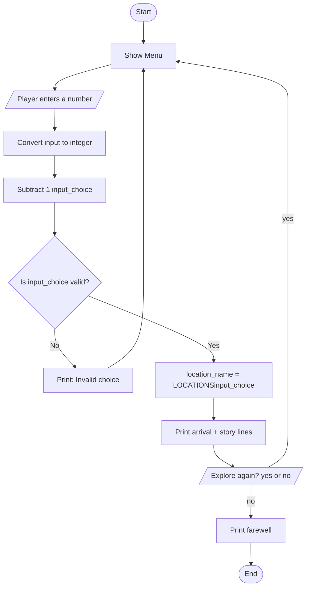

# Program Flow — Adventure Game

## How the Program Works

1. The program displays a menu built from the `LOCATIONS` list.
2. The player enters a number.
3. The input is converted to an integer and decremented by 1 to produce `input_choice`, which corresponds to the list index.
4. If `input_choice` is less than 0 or greater than or equal to the number of locations, the choice is considered invalid and the player is prompted again.
5. On a valid choice, the matching location name is looked up in `TEXTS` and each line is printed.
6. The player is asked whether they want to explore again. Any response other than `yes` exits the game.

---

## Pseudocode

```
LOCATIONS = ["Forest", "Cave", "Beach"]
TEXTS = dictionary mapping each location name to a list of story lines

function show_menu()
    print welcome message
    for each location in LOCATIONS with index starting at 1
        print index and location name


function play_game()
    loop forever
        show_menu()

        number_converted = convert player input to integer
        input_choice = number_converted - 1

        if input_choice < 0 OR input_choice >= length of LOCATIONS
            print invalid choice message
            continue loop

        location_name = LOCATIONS[input_choice]

        print arrival message including location_name

        for each line in TEXTS[location_name]
            print the line

        again = ask player "Explore again?"

        if again converted to lowercase is not "yes"
            print farewell message
            break loop
play_game()
```

---

## Mermaid Flowchart


